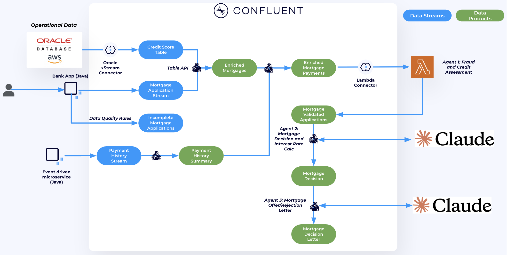
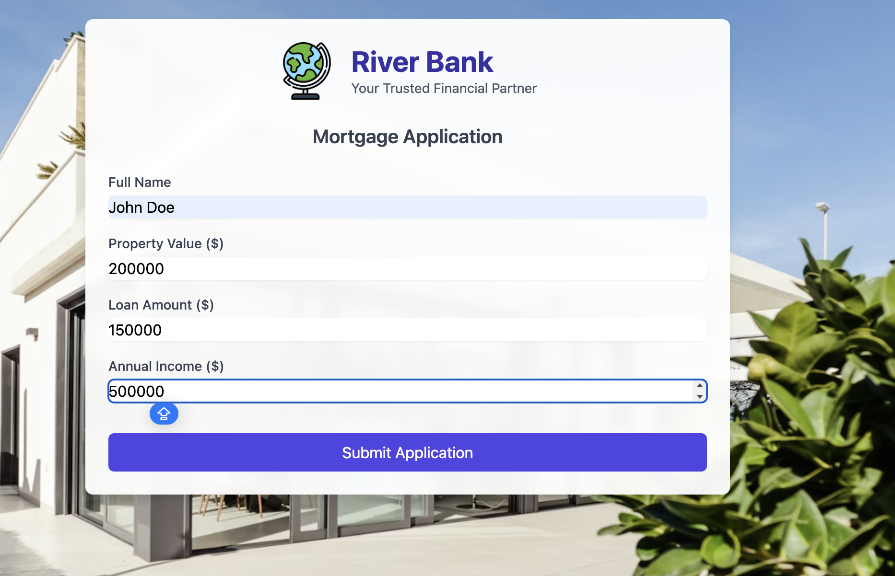

# End-to-end Demo

Now that we fully automated the mortgage application process. Let's demo this end to end. 



## Prerequisites

Before starting this demo, make sure you have completed [**Lab 1 – Connecting and Pre-processing Mortgage Applications**](../lab1/lab1-README.md) and [**Lab 2 – Building AI Agents to process Mortgage Applications**](../lab2/lab2-README.md).

## Demo

Follow the steps below to submit two mortgage applications: one for a high-credit score customer and one for a low-credit score customer.

1. Navigate to your Terraform directory and run:
   ```bash
   terraform output
   ```

   Look for the value of `webapp_endpoint`. It should look like this:

   ```
   agentic-webapp-c4e83e7c-583734374.us-east-2.elb.amazonaws.com
   ```

2. Open the URL in your browser.
3. Submit a new application using the following details:


   - **Full Name**: `John Doe`
   - **Property Value:** `200000`
   - **Loan Amount**: `150000`
   - **Annual Income:** `500000`

   > NOTE: The name must be John Doe to match an existing applicant with a known high credit score.
   >
   > The loan amount must be less than or equal to the property value.

   

4. Back in the [Flink UI](https://confluent.cloud/go/flink) in Confluent Cloud, run the queries below to check the application through the pipeline:

- Checkout the new application:
   ```sql
   SELECT * FROM `mortgage_applications` WHERE `customer_name` = 'John Doe' 
   ```

- Checkout the application after adding credit score data:
   ```sql
   SELECT * FROM `enriched_mortgage_applications` WHERE `borrower_name`= 'John Doe'
   ```
   You will see John has high credit score
- Checkout his historical payments
   ```sql
   SELECT * FROM `enriched_mortgage_with_payments` WHERE `borrower_name` = 'John Doe'
   ```
   > NOTE: Output might take 5-7 mins to populate.
- Checkout his Fraud and Credit Risk score
   ```sql
   SELECT * FROM `mortgage_validated_apps` WHERE borrower_name = 'John Doe'
   ```
- Checkout the mortgage decision
   ```sql
   SELECT * FROM mortgage_decisions WHERE borrower_name = 'John Doe' 
   ```
   Because of his high credit score and high income he got approved.
- Checkout the mortgage offer
   ```sql
   SELECT * FROM mortgage_final_decisions WHERE borrower_name = 'John Doe' 
   ```

5. Do the same for a low credit score applicant `Omer Soli`.


## Topics

**Next topic:** [**Clean-up**](../README.md#clean-up)

**Previous topic:**[**Lab 2 – Building AI Agents to process Mortgage Applications**](../lab2/lab2-README.md)


