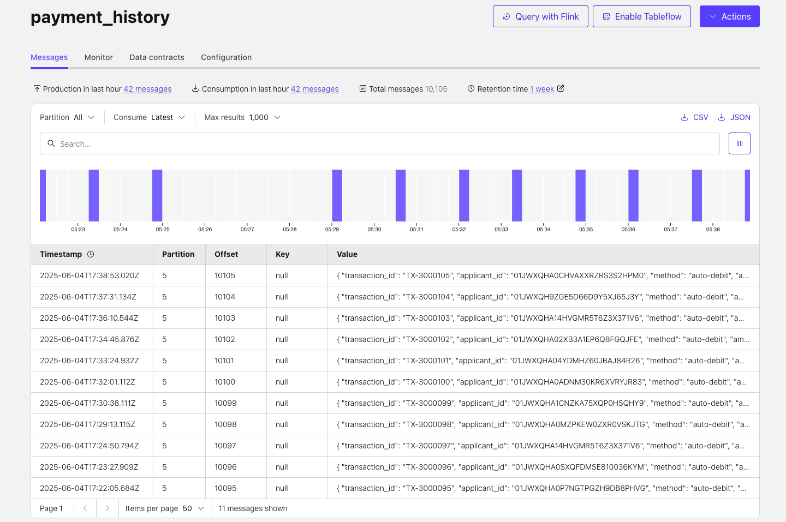
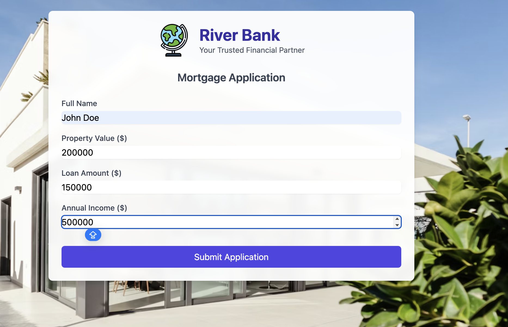

# Mortgage underwriting multi-agent system with Confluent Cloud

This repository showcases a demo for a mortgage provider that leverages **Confluent Cloud**, **AWS**, and **AI** to fully automate mortgage applications—from initial submission to final decision and offer.


## Prerequisites

Before you begin, ensure you have the following installed:

- **Confluent Cloud API Keys** - [Cloud resource management API Keys](https://docs.confluent.io/cloud/current/security/authenticate/workload-identities/service-accounts/api-keys/overview.html#resource-scopes) with Organisation Admin permissions are needed by Terraform to deploy the necessary Confluent resources.
- [Confluent CLI](https://docs.confluent.io/confluent-cli/current/install.html) - If on MAC run `brew install confluentinc/tap/cli`. 
- [Terraform](https://www.terraform.io/downloads.html) - v1.5.7 or later 
- [AWS CLI](https://aws.amazon.com/cli/) configured with appropriate credentials
- [Docker](https://www.docker.com/get-started) - 28.1.1 or later
- **Java** installed on your laptop - 17 or later
- **Maven** installed on your laptop - 3.9.9 or later
- [Optional] [Databricks Account](https://login.databricks.com/?intent=signup) - To analyze Mortgage desisions 


<details>
<summary>Installing prerequisites on MAC</summary>

Install the prerequisites by running:

```bash
brew install git terraform confluentinc/tap/cli awscli maven openjdk@17 && brew install --cask docker
```

</details>

<details>
<summary>Installing prerequisites on Windows</summary>

Install the prerequisites by running:

```powershell
winget install --id Git.Git -e
winget install --id Hashicorp.Terraform -e
winget install --id ConfluentInc.Confluent-CLI -e
winget install --id Amazon.AWSCLI -e
winget install --id Docker.DockerDesktop -e
winget install --id Oracle.JDK.17 -e
winget install --id Apache.Maven -e
```
</details> 


## Setup

1.  Clone the repo onto your local development machine using `git clone https://github.com/confluentinc/workshop-mortgage-underwriting-agentic-system.git`.
2. Change directory to demo repository and terraform directory.

   ```
   cd workshop-mortgage-underwriting-agentic-system/terraform
   ```
3. Configure AWS CLI

   If you already have the AWS CLI configured on your machine and pointing to the correct AWS account, you can skip this step.

   If you're using **AWS Workshop Studio**, click on **Get AWS CLI Credentials** to retrieve the necessary access key, secret key, and region. Then, run the following command to configure the CLI:
   <details>
   <summary>Click to expand for MAC</summary>

   ```
   export AWS_DEFAULT_REGION="<cloud_region>"
   export AWS_ACCESS_KEY_ID="<AWS_API_KEY>"
   export AWS_SECRET_ACCESS_KEY="<AWS_SECRET>"
   export AWS_SESSION_TOKEN="<AWS_SESSION_TOKEN>"
   ```

   </details>

   <details>
   <summary>Click to expand for Windows CMD</summary>

   ```
   set AWS_DEFAULT_REGION="<cloud_region>"
   set AWS_ACCESS_KEY_ID="<AWS_API_KEY>"
   set AWS_SECRET_ACCESS_KEY="<AWS_SECRET>"
   set AWS_SESSION_TOKEN="<AWS_SESSION_TOKEN>"
   ```


   </details>
4. Verify you are using the correct AWS account by running:

   ```
   aws sts get-caller-identity
   ```
   If you are using **AWS Workshop Studio**, you should have an output that looks like this:

   ```
   {
    "UserId": "AROA4AFJ7PWFSQYLGZ3YL:Participant",
    "Account": "xxxxxxxxxx",
    "Arn": "arn:aws:sts::xxxxxxxxxx:assumed-role/WSParticipantRole/Participant"
   }
   ```

5. In `terraform` directory,  create a `terraform.tfvars` file to store the Confluent Cloud API keys required by Terraform. Replace the placeholders below with your own keys and `{your-email}` with your email.

   <details>
   <summary>Click to expand for Mac</summary>

   ```bash
   cat > ./terraform.tfvars <<EOF
   confluent_cloud_api_key = "{Confluent Cloud API Key}"
   confluent_cloud_api_secret = "{Confluent Cloud API Key Secret}"
   email = "{your-email}"
   EOF
   ```
   </details>

   <details>
   <summary>Click to expand for Windows CMD</summary>

   ```bash
   echo confluent_cloud_api_key = "{Confluent Cloud API Key}" > terraform.tfvars
   echo confluent_cloud_api_secret = "{Confluent Cloud API Key Secret}" >> terraform.tfvars
   echo email = "{your-email}" >> terraform.tfvars
   ```
   </details>

5. Initialize Terraform

   ```bash
   terraform init
   ```

6. Deploy Infrastructure

   ```bash
   terraform apply --auto-approve
   ```

Terraform will take around 20 mins to deploy and it will deploy the following infrstructure components:

- Confluent Cloud Infrastructure components:
   1. Environment
   2. Cluster
   3. Topics and Schemas
   4. RBAC role-bindings
   5. Flink Compute pool
- AWS Infrastructure components:
   1. Oracle DB running on Amazon EC2
   2. Webapp running on Amazon Fargate
   3. Lambda function that will run Agent 1

## Post-Deployment Steps

> **Note:** The Oracle setup process takes approximately 10 minutes to complete after a successful Terraform deployment. Please wait at least 10 minutes before proceeding with the next steps.

Once the infrastructure is deployed, we can generate mortgage data. We'll use **ShadowTraffic** to send `mortgage_applications` and `historical_payments` to **Kafka**, and `credit_score` data to **Oracle**.

1. Open the repo directory in a new terminal window.
2. Change directory to `data-gen` directory:
   ```
   cd terraform/data-gen
   ```
3. Get a ShadowTraffic License Key. [Sign up for ShadowTraffic](https://shadowtraffic.io/pricing.html) to obtain a license key.

   **If you already have a license key, you can skip this step.**

   > ⚠️ **Note**: If you're running the workshop before July 1, 2025, skip this step and use the `licence.env` file included in this repository.
   
   - Inside the `data-gen` directory, create a file named `license.env` and add your license variables.


      The file should look like this:
      ```
      LICENSE_ID=e2c218c6-00ef-41d3-8c93-7debea33266e
      LICENSE_EMAIL=<your_email>
      LICENSE_ORGANIZATION=<your_company>
      LICENSE_EDITION=ShadowTraffic Free Trial
      LICENSE_EXPIRATION=<date>
      LICENSE_SIGNATURE=rbnDYGuNaxk7j5HwdsNzJz4dDROlLX3Haf5tjBOwCJv7Y5rNg6D0TcJQA/gODKiQhY5f1rg9g1pPDiSuZUFfY9lUZGGx99HquZAAENDotezebIY1ILf8DVDSq9hchvYyceuL1irNgynpaSvfh+EeakeGQBbm6FtihWEJmhUMjQoJVMyckV9z9OVMhluWI3PAKLI8ryelOc3QsZiKoIwlledY5fYzvUZwOBG+GpLOps15xgTJGFVDTy206xXzPdCGMh5DTwh7hXYyHfcZepiV2DGqEk+MPGQGxuKvGuiOnE/FhPjdj2BUJWyEswo6MPpgsyl4FVcLj/lfgWAi+Gt/Pg==
      ```
4. Run ShadowTraffic

   > ⚠️ **Note:** If you're using **AWS Workshop Studio**, start data generation **immediately before beginning the workshop** and try to **avoid taking long breaks**.  
   >  
   > Due to reduced Bedrock service limits in Workshop Studio, taking long breaks can cause the message backlog to grow. This increases the risk of request throttling when running agents later in the workshop.


   <details>
   <summary>Click to expand for MAC</summary>

   ```
   ./run.sh
   ```

   </details>

   <details>
   <summary>Click to expand for Windows</summary>

   ```
   run.bat
   ```

   </details>

   > ⚠️ **Note:** Leave this terminal open all the time.


   > ⚠️ **Note:** Shadow Traffic is configure to generate a new mortgage application every 10 mins.

5. To verify that the data has been successfully generated, go to the [Confluent Cloud Topic UI](https://confluent.cloud/go/topics). Select your environment and cluster, then click on the `payment_history` topic to confirm that data is being produced.

   


### Submit a Mortgage Application from the Website

Submit a Mortgage application for `John Doe` - an applicant with high-credit-score.

1. Open a new terminal and navigate to your Terraform directory and run:
   ```bash
   terraform output
   ```

   Look for the value of `webapp_endpoint`. It should look like this:

   ```
   agentic-webapp-c4e83e7c-583734374.us-east-2.elb.amazonaws.com
   ```

2. Open the URL in your browser.
3. Submit a new application using the following details:


   - **Full Name**: `John Doe`
   - **Property Value:** `200000`
   - **Loan Amount**: `150000`
   - **Annual Income:** `500000`

   > NOTE: The name must be John Doe to match an existing applicant with a known high credit score.
   >
   > The loan amount must be less than or equal to the property value.

   

4. To verify that the data has been successfully generated, go to the [Confluent Cloud Topic UI](https://confluent.cloud/go/topics). Select your environment and cluster, then click on the `mortgage_applications`, you should see the new application there.


## Demo

> **Estimated time:** 90 minutes

This workshop includes two labs:

1. [**Lab 1 – Connecting and Pre-processing Mortgage Applications**](./lab1/lab1-README.md):  
   Use the fully managed **Oracle XStream CDC Source Connector** to stream credit score data from Oracle DB to **Confluent Cloud**. Then, leverage **Confluent Cloud for Apache Flink** to transform the live stream of mortgage applications into a real-time, contextualized data product—ready to power AI agents.

2. [**Lab 2 – Building AI Agents to process Mortgage Applications**](./lab2/lab2-README.md):  
   Use **Confluent Cloud for Apache Flink**, **AWS Lambda**, **Amazon Bedrock** to build three AI agents that run sequentially to fully automate the mortgage application process.


After completing Labs 1 and 2, you can run an end-to-end [demo](./Demo/demo-README.md) by submitting an application for a high-credit customer.


## Topics

**Next topic:** [Lab 1 - Connecting and pre-processing mortgage applications](./lab1/lab1-README.md)

## Clean-up
Once you are finished with this demo, remember to destroy the resources you created, to avoid incurring charges. You can always spin it up again anytime you want.

Before tearing down the infrastructure, delete the Oracle xstream and Lambda connector, as they were created outside of Terraform and won't be automatically removed:

```
confluent connect cluster delete <CONNECTOR_ID> --cluster <CLUSTER_ID> --environment <ENVIRONMENT_ID> --force
```

To destroy all the resources created run the command below from the ```terraform``` directory:

```
terraform destroy --auto-approve
```

