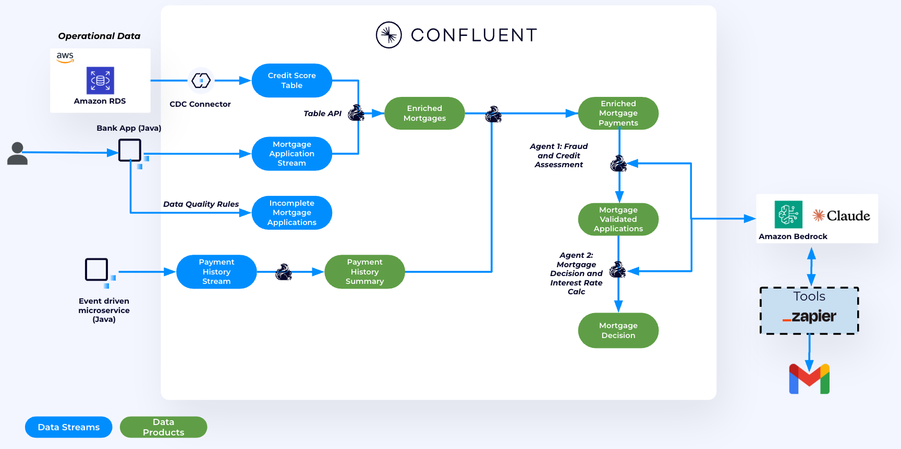
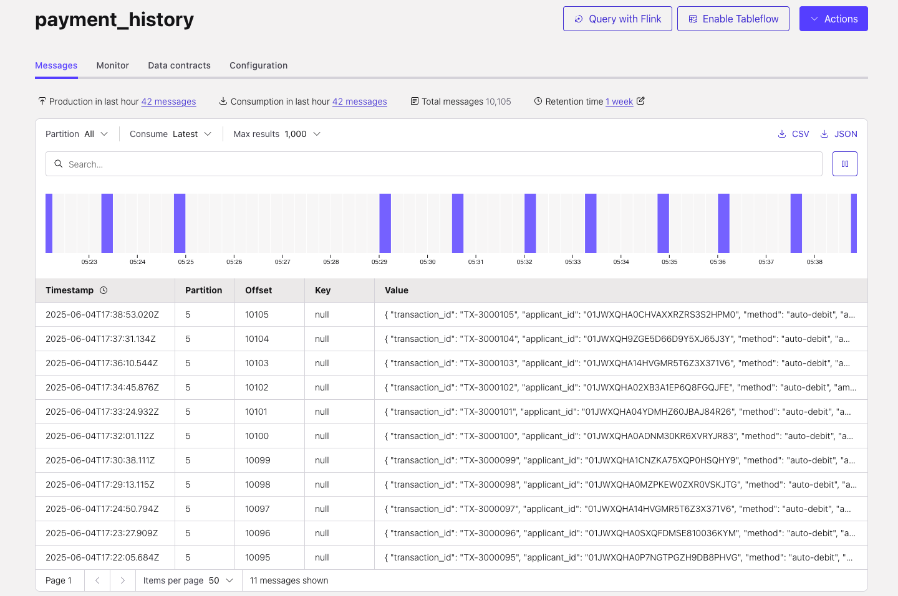
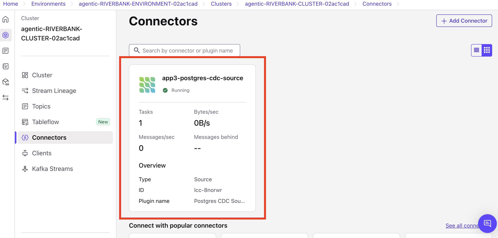
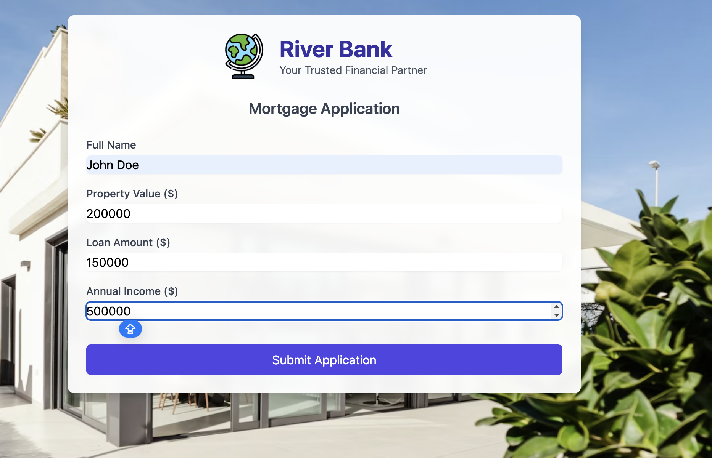

# Mortgage underwriting multi-agent system with Confluent Cloud

This repository showcases a demo for a mortgage provider that leverages **Confluent Cloud**, **AWS**, and **AI** to fully automate mortgage applications—from initial submission to final decision and offer.

*Instructors: if you're hosting this workshop for a group, ensure that you've completed the MCP server setup in the [MCP Email for Workshops](https://github.com/confluentinc/mcp-email-for-workshops) repo.*



## Prerequisites

Before starting, make sure you have:

| Requirement | Check |
|-------------|-------|
| **Confluent Cloud account** with [API Keys](https://docs.confluent.io/cloud/current/security/authenticate/workload-identities/service-accounts/api-keys/overview.html#resource-scopes) (`Cloud resource management` permissions) | [Sign up here](https://cnfl.io/dswt2026) |
| **Terraform** v1.5.7+ | `brew install terraform` or [download](https://www.terraform.io/downloads.html) |
| **Git CLI** | `brew install git` |
| **Container runtime** (Docker Desktop, Colima, or Podman) | Install one runtime |


<details>
<summary>Installing prerequisites on MAC</summary>

1. Install dependencies:
   ```bash
   brew install git terraform
   ```

2. Install a container runtime:
   ```bash
   brew install colima docker
   # brew install --cask docker       # Docker Desktop
   # brew install podman              # Podman
   ```

</details>

<details>
<summary>Installing prerequisites on Windows</summary>

1. Install dependencies:
   ```powershell
   winget install --id Git.Git -e
   winget install --id Hashicorp.Terraform -e
   ```

2. Install a container runtime:
   ```powershell
   winget install --id Docker.DockerDesktop -e
   # Alternatively, install Podman: winget install --id RedHat.Podman -e
   ```

</details>

## Setup


1.  Clone the repo and change directory to the terraform workshop directory:
      ```
      git clone https://github.com/confluentinc/workshop-mortgage-underwriting-agentic-system.git
      cd workshop-mortgage-underwriting-agentic-system/terraform/workshop
      ```
2. Rename the template file and update it with your values:
   **Mac/Linux:**
   ```bash
   mv terraform.tfvars.example terraform.tfvars
   ```
   **Windows:**
   ```cmd
   ren terraform.tfvars.example terraform.tfvars
   ```
   Open `terraform.tfvars` in your editor and replace the following placeholders:

   | Variable | Where to get it |
   |----------|----------------|
   | `confluent_cloud_api_key` | Your Confluent Cloud API key |
   | `confluent_cloud_api_secret` | Your Confluent Cloud API secret |
   | `mcp_url` | Provided by your instructor |
   | `mcp_token` | Provided by your instructor |
   | `bedrock_access_key_id` | Provided by your instructor |
   | `bedrock_secret_access_key` | Provided by your instructor |
   | `db_host` | Provided by your instructor |
   | `db_name` | Provided by your instructor (e.g. `app1`, `app27`) |
   | `db_password` | Provided by your instructor |

> [!CAUTION]
> **Your container runtime must be running before deploying Terraform.**
> Terraform needs a running container runtime (Docker, Colima, or Podman) to build and start the webapp container. If it is not running, `terraform apply` will fail.

3. Verify your container runtime is running

   | Runtime | Check status | Start |
   |---------|-------------|-------|
   | Docker Desktop | `docker info` | Open Docker Desktop |
   | Colima | `colima status` | `colima start` |
   | Podman | `podman machine info` | `podman machine start` |

4. Initialize and deploy Terraform

   ```bash
   terraform init
   terraform apply --auto-approve
   ```

> [!IMPORTANT]
> Terraform will take around 10 minutes to deploy.

## Post-Deployment Verification

Terraform automatically deploys the **data generator**, the **Postgres CDC Source Connector**, and the **mortgage webapp**. The data generator runs continuously in a Docker container named `mortgage-datagen`, sending `mortgage_applications` and `historical_payments` to **Kafka**, and `credit_score` data to **Postgres**.

> [!CAUTION]
> **Do not stop the data generator container (`mortgage-datagen`).** It must run continuously to advance Flink watermarks. Stopping it will break the labs.

> **Note:** The data generator produces a new mortgage application every 10 minutes.

1. Verify the data generator is running:
   ```
   docker logs mortgage-datagen
   ```

2. To verify that the data has been successfully generated, go to the [Confluent Cloud Topic UI](https://confluent.cloud/go/topics). Select your environment and cluster, then click on the `payment_history` topic to confirm that data is being produced.

   

3. In the [Connectors UI](https://confluent.cloud/go/connectors), verify that the Postgres CDC Source Connector is listed and shows a **Running** status.

   


### Submit a Mortgage Application from the Website

Submit a Mortgage application for `John Doe` - an applicant with high-credit-score.

1. Open http://localhost:5001 in your browser.
2. Submit a new application using the following details:


   - **Full Name**: `John Doe`
   - **Property Value:** `200000`
   - **Loan Amount**: `150000`
   - **Annual Income:** `500000`

> [!NOTE]
> The name must be John Doe to match an existing applicant with a known high credit score.
> The loan amount must be less than or equal to the property value.

   

3. To verify that the data has been successfully generated, go to the [Confluent Cloud Topic UI](https://confluent.cloud/go/topics). Select your environment and cluster, then click on the `mortgage_applications`, you should see the new application there.


## Demo

> **Estimated time:** 90 minutes

This workshop includes two labs:

1. [**Lab 1 – Connecting and Pre-processing Mortgage Applications**](./lab1/lab1-README.md):
   Use the fully managed **Postgres CDC Source Connector** to stream credit score data from the instructor-provided Postgres DB to **Confluent Cloud**. Then, leverage **Confluent Cloud for Apache Flink** to transform the live stream of mortgage applications into a real-time, contextualized data product—ready to power AI agents.

2. [**Lab 2 – Building AI Agents to process Mortgage Applications**](./lab2/lab2-README.md):
   Use **Confluent Cloud for Apache Flink** and **Amazon Bedrock** to build two AI agents that run sequentially to fully automate the mortgage application process.


After completing Labs 1 and 2, you can run an end-to-end [demo](./Demo/demo-README.md) by submitting an application for a high-credit customer.


## Topics

**Next topic:** [Lab 1 - Connecting and pre-processing mortgage applications](./lab1/lab1-README.md)

## Clean-up
Once you are finished with this demo, remember to destroy the resources you created, to avoid incurring charges. You can always spin it up again anytime you want.

To destroy all the resources created (including the Postgres CDC connector, data generator, and webapp containers) run the command below from the ```terraform/workshop``` directory:

```
terraform destroy --auto-approve
```
