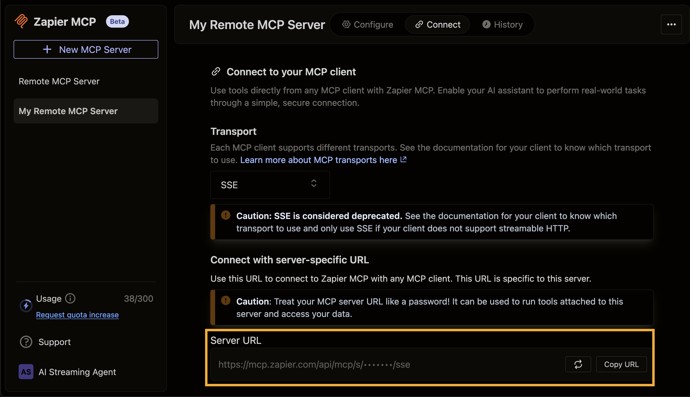

## Zapier Remote MCP Server Setup

Create a Zapier MCP server for tool calling:

### 1. Create free Zapier Account

Sign up for a free account at [zapier.com](https://zapier.com/sign-up) and verify your email.

### 2. Create MCP Server

Visit [mcp.zapier.com](https://mcp.zapier.com/mcp/servers), choose **"Other"** as MCP Client, and create your server.

### 3. Add Tools

Add the following tool to your MCP server:

- **`Gmail: Send Email`** tool (authenticate via SSO).

    

### 4. Get SSE Endpoint URL

Click **"Connect",** choose **"Other"** for your client, then change transport to **"SSE Endpoint"**, and **copy the URL.** This is the `zapier_sse_endpoint` you will need to enter when deploying the lab.

Make sure the endpoint URL you have ends with `/sse`, and copy it somewhere safe. You will enter this value as the `zapier_sse_endpoint` when deploying the workshop later.

## Checklist

- [ ] Created MCP server and chose "Other" as the MCP client ([step 2](#step-2))
- [ ] Added **`Gmail: Send Email`** tool ([step 3](#step-3))
- [ ] Server URL ends in `/sse` ([step 4](#step-4))
- [ ] Copied the URL somewhere safe, to enter it later during deployment ([step 4](#step-4))

## Navigation

- **← Back to Overview**: [Main README](../README.md)
