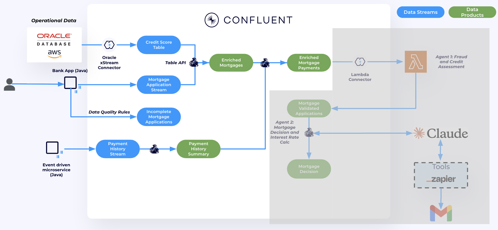
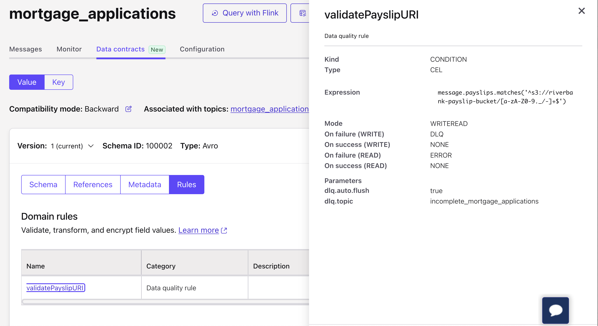
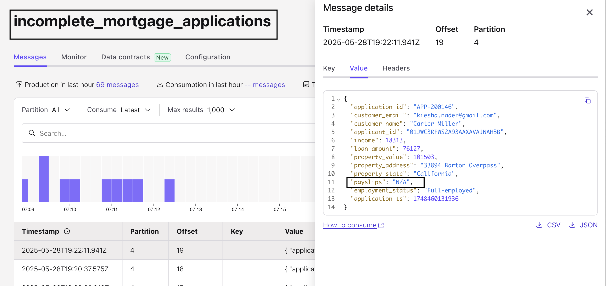
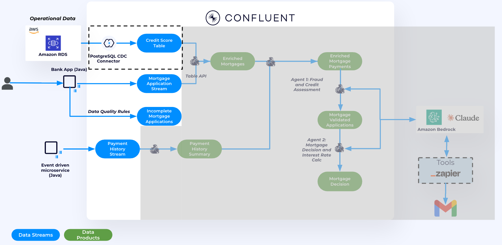
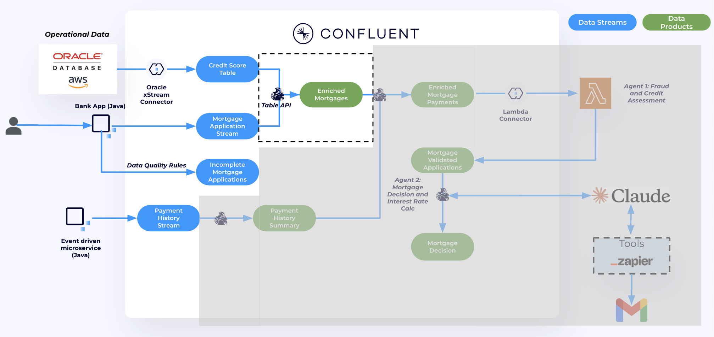
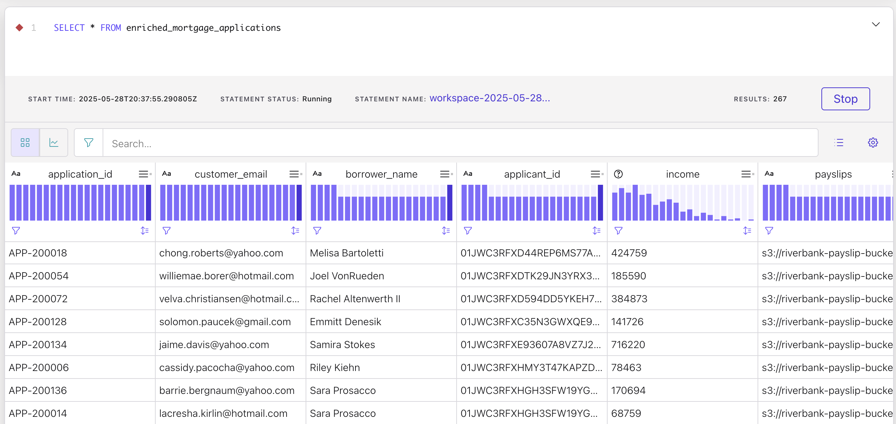
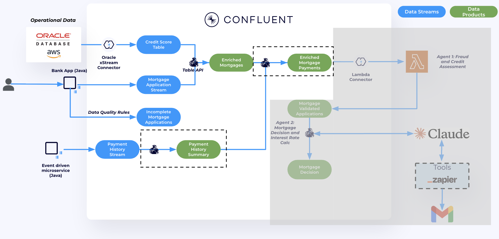

# Connecting and Pre-processing Mortgage Applications

In this lab, we will source credit score data from an instructor-provided Postgres DB using the fully managed **Postgres CDC Source connector**. Then, we'll use **Confluent Cloud for Apache Flink** to enrich mortgage applications with credit score data from Postgres and historical payment data.

By the end of this lab, we will have built a real-time, contextualized data product that will be used to power AI agents in the next lab.

### Steps:
1. Use the **Postgres CDC Source connector** to send credit score data from Postgres to the `APPLICANT_CREDIT_SCORE` topic in Confluent Cloud.
2. Use the **Flink Java Table API** to join `mortgage_applications` with `APPLICANT_CREDIT_SCORE`, creating a new enriched real-time data product called `enriched_mortgage_applications`.
3. Use **Flink SQL** to join `enriched_mortgage_applications` with `payment_history`, resulting in the final real-time data product that will be used in the next lab.



## **[OPTIONAL] Using Confluent Cloud Data Quality Rules**

We want to make sure that any data produced adheres to a specific format. In our case, we want to make sure that any Mortgage Application coming in has a valid payslip URI. This check is done by using [Data Quality Rules](https://docs.confluent.io/cloud/current/sr/fundamentals/data-contracts.html#data-quality-rules), these rules are set in Confluent Schema registry, and pushed to the clients, where they are enforced. No need to change any code.

The rules were already created by Terraform, there is no need to do anything here except validate that it is working.

1. In the [`mortgage_applications`](https://confluent.cloud/go/topics) topic UI, select your environment and cluster. Then, navigate to **Data Contracts**. Under **Rules**, you’ll see that a rule has already been created.

   
   The rule specifies that the `payslips` field must match the following regex pattern:  
   `^s3://riverbank-payslip-bucket/[a-zA-Z0-9._/-]+$`  
   This ensures the value follows a valid S3 URI format. Any event that doesn't match this pattern will be routed to a dead-letter queue topic named `incomplete_mortgage_applications`.

   

2. To validate that it is working go to the DLQ topic and inspect the message headers there.
   
   


## **Setting up the Fully managed Postgres CDC Source Connector**

We will source credit score data from the instructor-provided Postgres DB to the `PROD.PUBLIC.APPLICANT_CREDIT_SCORE` topic in Confluent.



1. In the [Connectors UI](https://confluent.cloud/go/connectors), add a new **Postgres CDC Source** Connector.
2. Enter your Confluent Cluster credentials, select **Service Account**, then choose **Existing Account**. From the drop-down menu, select the service account that was created for you by Terraform. The service account name should follow this format: `<prefix>-app-manager-<random_suffix>`. Check **Add all required ACLs**, then click **Continue**.
3. Enter Postgres connection details from `terraform output postgres_cdc_connector`, then click **Continue**.
4. For Configuration enter the following:
   - **Output Key and Value** as `AVRO`
   - **Topic prefix** as `PROD`
   - **Table include list** as `public.applicant_credit_score`
   - In **advanced configurations** set **Decimal handling mode** to `double` (if available)
5. Follow the wizard to create the connector.
6. After a few minutes, the connector should be up and running. Data will begin flowing from Postgres to the `PROD.PUBLIC.APPLICANT_CREDIT_SCORE` topic.

Finally, to prepare this topic for joining with `mortgage_applications`, we will set the changelog mode to `append` instead of `retract`.

7. Navigate to [Flink UI](https://confluent.cloud/go/flink) in Confluent Cloud and select the demo environment.
8. Click on **Open SQL Workspace**.
9. On the top right corner of your workspace select the cluster as your database.
10. Use the query editior to run the following query

   ```sql
   ALTER TABLE `PROD.PUBLIC.APPLICANT_CREDIT_SCORE` SET ('changelog.mode' = 'append' , 'value.format' = 'avro-registry');
   ```

Now we are ready to enrich Mortage applications with Credit score data.

## **Enrich Mortgage Applications with Credit Score data**

We will now enrich mortgage applications with credit score data. This will create a new data product called `enriched_mortgage_applications`, which joins the `mortgage_applications` topic with the `PROD.PUBLIC.APPLICANT_CREDIT_SCORE` topic.



<details>
<summary>Option A: Java Table API (requires Maven)</summary>

1. Open a new terminal window in the repository's root directory.

2. Navigate to the Java code directory:
   ```bash
   cd instructor-led/terraform/code/FlinkTableAPI/
   ```
3. Compile the Java code:
   ```
   mvn clean package
   ```

   > ⚠️ **Note**: If you encounter this error: `Caused by: java.lang.NoSuchMethodError: 'com.sun.tools.javac.tree.JCTree com.sun.tools.javac.tree.JCTree$JCImport.getQualifiedIdentifier()'` 
   > 
   > Try running `mvn clean package -Dspotless.check.skip=true`

4. Run the compiled application. To get the exact command, run`terraform output` from the Terraform directory. Look for the value of `Flink_exec_command.` The command should look like this:
   ```
   java -jar target/flink-table-api-java-demo-0.1.jar '<Confluent_environment_name>' '<confluent_cluster_name>'
   ```
5. Back in [Flink UI](https://confluent.cloud/go/flink) in Confluent Cloud run:

   ```sql
   SELECT * FROM enriched_mortgage_applications
   ```

   

   > **NOTE: You should see John's application in there.**

</details>

<details>
<summary>Option B: Flink SQL (no Maven required)</summary>

1. In [Flink UI](https://confluent.cloud/go/flink), open a SQL workspace.
2. Run the following to create the table and populate it:

   ```sql
   SET 'client.statement-name' = 'enriched-mortgage-applications-materializer';
   CREATE TABLE `enriched_mortgage_applications` (
     application_id STRING,
     customer_email STRING,
     borrower_name STRING,
     applicant_id STRING,
     income DOUBLE,
     payslips STRING,
     loan_amount DOUBLE,
     property_address STRING,
     property_state STRING,
     property_value DOUBLE,
     employment_status STRING,
     credit_score DOUBLE,
     credit_utilization DOUBLE,
     open_credit_accounts DOUBLE,
     recent_defaults DOUBLE,
     debt_to_income_ratio DOUBLE,
     application_ts TIMESTAMP_LTZ(3),
     WATERMARK FOR application_ts AS application_ts - INTERVAL '5' SECOND
   )
   AS
   SELECT
     m.application_id,
     m.customer_email,
     m.customer_name AS borrower_name,
     m.applicant_id,
     CAST(m.income AS DOUBLE) AS income,
     m.payslips,
     CAST(m.loan_amount AS DOUBLE) AS loan_amount,
     m.property_address,
     m.property_state,
     CAST(m.property_value AS DOUBLE) AS property_value,
     m.employment_status,
     c.after.CREDIT_SCORE AS credit_score,
     c.after.CREDIT_UTILIZATION AS credit_utilization,
     c.after.OPEN_CREDIT_ACCOUNTS AS open_credit_accounts,
     c.after.PUBLIC_RECORDS AS recent_defaults,
     CAST(ROUND((CAST(m.loan_amount AS DECIMAL(10, 2)) / CAST(m.income AS DECIMAL(10, 2))) * 100, 2) AS DOUBLE) AS debt_to_income_ratio,
     m.application_ts
   FROM `mortgage_applications` m
   JOIN `PROD.PUBLIC.APPLICANT_CREDIT_SCORE` c
   ON m.applicant_id = c.after.APPLICANT_ID;
   ```

> [!IMPORTANT]
> This query should run continuously and **must not be stopped or deleted**.  
> Add new cells **above or below** this one before proceeding.

3. Verify output:

   ```sql
   SELECT * FROM enriched_mortgage_applications;
   ```

</details>


## **Using Flink SQL to enrich Mortgage applications with Historical payments**

Now we will use **Flink SQL** to further enrich mortgage applications with historical payment data.

First, we will aggregate all previous payments for each applicant.

Then, we will perform a **temporal join** between `enriched_mortgage_applications` and `applicant_payment_summary` to create a new data product: `enriched_mortgage_with_payments`.



1. Back in the [Flink UI](https://confluent.cloud/go/flink) on Confluent Cloud, run the following to create `applicant_payment_summary`—a new data product that aggregates all payments for each applicant.

   ```sql
   SET 'client.statement-name' = 'applicant-payment-summary-materializer';
   CREATE TABLE `applicant_payment_summary` (
   `applicant_id` STRING NOT NULL,
   `updated_at` TIMESTAMP_LTZ(3) NOT NULL,
   `payment_history` ARRAY<ROW(
      transaction_id STRING, 
      `method` STRING, 
      amount DOUBLE, 
      status STRING, 
      failure_reason STRING, 
      payment_date STRING
   )>,
   WATERMARK FOR `updated_at` AS `updated_at` - INTERVAL '5' SECOND
   )
   AS
   SELECT 
   applicant_id,
   MAX(`$rowtime`) AS updated_at,
   ARRAY_AGG(
      ROW(
         transaction_id, 
         `method`, 
         amount, 
         status, 
         failure_reason, 
         payment_date
      )
   ) AS payment_history
   FROM `payment_history`
   GROUP BY applicant_id;
   ```

> [!IMPORTANT]
> This query should run continuously and **must not be stopped or deleted**.  
> Add new cells **above or below** this one before proceeding.

2. In a new cell, check the output of `applicant_payment_summary`

   ```sql
   SELECT * FROM applicant_payment_summary
   ```


3. Join `enriched_mortgage_applications` with `applicant_payment_summary` and use TTL to manage Flink state.

   ```sql
   SET 'sql.state-ttl' = '1 min';
   SET 'client.statement-name' = 'enriched-mortgage-payments-materializer';
   CREATE TABLE `enriched_mortgage_with_payments`
   WITH ('changelog.mode' = 'append')
      AS
      SELECT
      m.application_id,
      m.customer_email,
      m.borrower_name,
      m.applicant_id,
      m.income,
      m.payslips,
      m.loan_amount,
      m.property_address,
      m.property_state,
      m.property_value,
      m.employment_status,
      m.credit_score,
      m.credit_utilization,
      m.open_credit_accounts,
      m.recent_defaults,
      m.debt_to_income_ratio,
      m.application_ts,
      p.payment_history
     FROM `enriched_mortgage_applications` m
     LEFT JOIN `applicant_payment_summary` FOR SYSTEM_TIME AS OF m.application_ts AS p
     ON m.applicant_id = p.applicant_id
      WHERE m.property_value < 500000;
   ```

> [!IMPORTANT]
> This query should run continuously and **must not be stopped or deleted**.  
> Add new cells **above or below** this one before proceeding.  


2. In a new cell, check the output of `enriched_mortgage_with_payments`

   ```sql
   SELECT * FROM enriched_mortgage_with_payments
   ```
   > ⚠️ **Note**: It may take upto 2 mins for the data to appear in Flink UI.

   > ⚠️ **Note**:: Some applicants will not have any historical payments.

checkout John's application

   ```sql
   SELECT * FROM enriched_mortgage_with_payments WHERE borrower_name = 'John Doe'
   ```

We are now ready to move over to building our AI Agents.

## Topics

**Next topic:** [**Lab 2 – Building AI Agents to process Mortgage Applications**](../lab2/lab2-README.md)

**Previous topic:** [**Deployment**](../README.md)