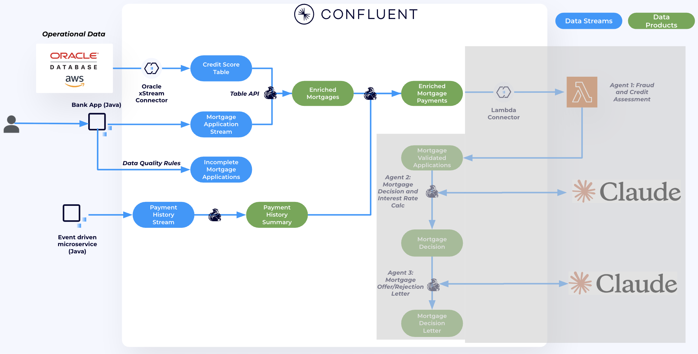
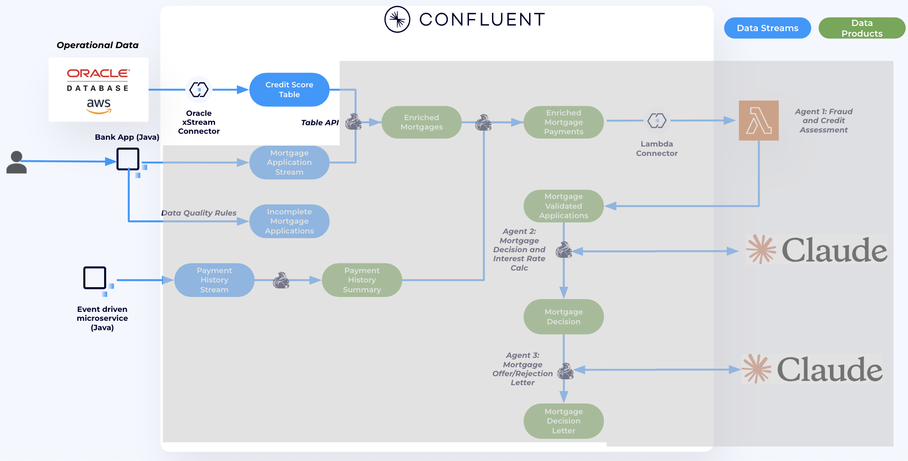
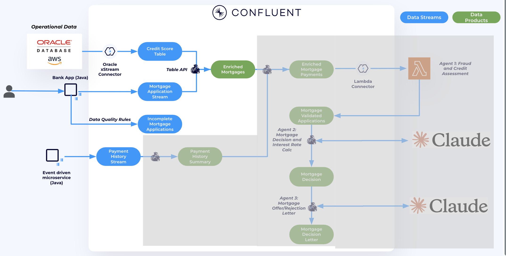
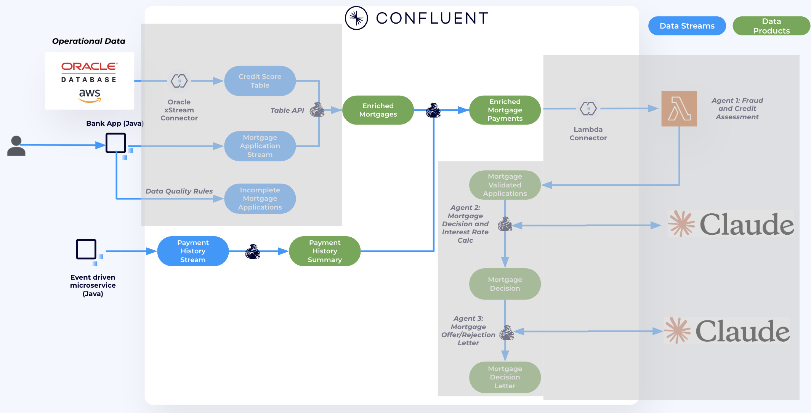

# Connecting and Pre-processing Mortgage Applications

In this lab, we will source credit score data from Oracle DB using the fully managed **Oracle CDC XStream connector**. Then, we'll use **Confluent Cloud for Apache Flink** to enrich mortgage applications with credit score data from Oracle and historical payment data.

By the end of this lab, we will have built a real-time, contextualized data product that will be used to power AI agents in the next lab.

### Steps:
1. Use the **Oracle XStream connector** to send credit score data from Oracle to the `APPLICANT_CREDIT_SCORE` topic in Confluent Cloud.
2. Use the **Flink Java Table API** to join `mortgage_applications` with `APPLICANT_CREDIT_SCORE`, creating a new enriched real-time data product called `enriched_mortgage_applications`.
3. Use **Flink SQL** to join `enriched_mortgage_applications` with `payment_history`, resulting in the final real-time data product that will be used in the next lab.



## **[OPTIONAL] Using Confluent Cloud Data Quality Rules**

We want to make sure that any data produced adheres to a specific format. In our case, we want to make sure that any Mortgage Application coming in has a valid payslip URI. This check is done by using [Data Quality Rules](https://docs.confluent.io/cloud/current/sr/fundamentals/data-contracts.html#data-quality-rules), these rules are set in Confluent Schema registry, and pushed to the clients, where they are enforced. No need to change any code.

The rules were already created by Terraform, there is no need to do anything here except validate that it is working.

1. In the [`mortgage_applications`](https://confluent.cloud/go/topics) topic UI, select your environment and cluster. Then, navigate to **Data Contracts**. Under **Rules**, you’ll see that a rule has already been created.

   
   The rule specifies that the `payslips` field must match the following regex pattern:  
   `^s3://riverbank-payslip-bucket/[a-zA-Z0-9._/-]+$`  
   This ensures the value follows a valid S3 URI format. Any event that doesn't match this pattern will be routed to a dead-letter queue topic named `incomplete_mortgage_applications`.

   

2. To validate that it is working go to the DLQ topic and inspect the message headers there.
   
   


## **Setting up the Fully managed Oracle XStream CDC Source Connector**



We will source Credit Score data from the Oracle DB to `PROD.SAMPLE.APPLICANT_CREDIT_SCORE` topic in Confluent.

1. In the [Connectors UI](https://confluent.cloud/go/connectors), add a new Oracle XStream CDC Source Connector Connector.
2.   Enter your Confluent Cluster credentials, select **Service Account**, then choose **Existing Account**. From the drop-down menu, select the service account that was created for you by Terraform. The service account name should follow this format: `<prefix>-app-manager-<random_suffix>`.


   Also, check **Add all required ACLs** checkbox. Then click **Continue**.

3.  Enter Oracle details - Run ```terraform output oracle_xstream_connector``` from `terraform` directory to get the details. Output should look as follows:
   

   After you enter the details, click **Continue**


4. For Configuration enter the following:
   - **Output Key and Value** as `AVRO`
   - **Topic prefix** as `PROD`
   - **Table include list** as `SAMPLE.*`
      >NOTE: this has to be sample otherwise connector will not find the data.
   
   

   - In **advanced configurations** set **Decimal handling mode** to `double`.
   

   - Click **Continue**


5. Follow the wizard to create the connector.


6. After a few minutes, the connector should be up and running. Data will begin flowing from the Oracle DB to the `PROD.SAMPLE.APPLICANT_CREDIT_SCORE` topic.

   To verify that the connector is working properly, go to the [Confluent Topic UI](https://confluent.cloud/go/topics), select your environment and cluster, then open the `PROD.SAMPLE.APPLICANT_CREDIT_SCORE` topic to view the incoming messages.

   


Finally, to prepare this topic for joining with `mortgage_applications`, we will set the changelog mode to `append` instead of `retract`.

7. Navigate to [Flink UI](https://confluent.cloud/go/flink) in Confluent Cloud and select the demo environment.
8. Click on **Open SQL Workspace**.
9. On the top right corner of your workspace select the cluster as your database.
10. Use the query editior to run the follwoing query

   ```sql
   ALTER TABLE `PROD.SAMPLE.APPLICANT_CREDIT_SCORE` SET ('changelog.mode' = 'append' , 'value.format' = 'avro-registry');
   ```

Now we are ready to enrich Mortage applications with Credit score data.

## **Enrich Mortgage Applications with Credit Score data using Confluent Cloud Flink Table API**

We will now use the **Flink Table API** to enrich mortgage applications with credit score data. This will create a new data product called `enriched_mortgage_applications`, which joins the `mortgage_applications` topic with the `PROD.SAMPLE.APPLICANT_CREDIT_SCORE` topic.



1. Open a new terminal window in the repository's root directory.

2. Navigate to the Java code directory:
   ```bash
   cd terraform/code/FlinkTableAPI/
   ```
3. Compile the Java code:
   ```
   mvn clean package
   ```
4. Run the compiled application. To get the exact command, run`terraform output` from the Terraform directory. Look for the value of `Flink_exec_command.` The command should look like this:
   ```
   java -jar target/flink-table-api-java-demo-0.1.jar '<Confluent_environment_name>' '<confluent_cluster_name>'
   ```
5. Back in [Flink UI](https://confluent.cloud/go/flink) in Confluent Cloud run:

   ```sql
   SELECT * FROM enriched_mortgage_applications
   ```

   


## **Using Flink SQL to enrich Mortgage applications with Historical payments**

Now we will use **Flink SQL** to further enrich mortgage applications with historical payment data.

First, we will aggregate all previous payments for each applicant.

Then, we will perform a **temporal join** between `enriched_mortgage_applications` and `applicant_payment_summary` to create a new data product: `enriched_mortgage_with_payments`.



1. Back in the [Flink UI](https://confluent.cloud/go/flink) on Confluent Cloud, run the following to create `applicant_payment_summary`—a new data product that aggregates all payments for each applicant.

   ```sql
   SET 'client.statement-name' = 'applicant-payment-summary-materializer';
   CREATE TABLE `applicant_payment_summary` (
   `applicant_id` STRING NOT NULL,
   `updated_at` TIMESTAMP_LTZ(3) NOT NULL,
   `payment_history` ARRAY<ROW(
      transaction_id STRING, 
      `method` STRING, 
      amount DOUBLE, 
      status STRING, 
      failure_reason STRING, 
      payment_date STRING
   )>,
   WATERMARK FOR `updated_at` AS `updated_at` - INTERVAL '5' SECOND
   )
   AS
   SELECT 
   applicant_id,
   MAX(`$rowtime`) AS updated_at,
   ARRAY_AGG(
      ROW(
         transaction_id, 
         `method`, 
         amount, 
         status, 
         failure_reason, 
         payment_date
      )
   ) AS payment_history
   FROM `payment_history`
   GROUP BY applicant_id;
   ```

   > **Note:** This query should run continuously and **must not be stopped or deleted**.  
   > Add new cells **above or below** this one before proceeding.

2. In a new cell, check the output of `applicant_payment_summary`

   ```sql
   SELECT * FROM applicant_payment_summary
   ```


3. Use a **temporal join** to join `enriched_mortgage_applications` with `applicant_payment_summary` at the time the mortgage application was placed.

   ```sql
   SET 'client.statement-name' = 'enriched-mortgage-payments-materializer';
   CREATE TABLE `enriched_mortgage_with_payments` (
   `application_id` STRING,
   `customer_email` STRING,
   `borrower_name` STRING,
   `applicant_id` STRING,
   `income` DOUBLE,
   `payslips` STRING,
   `loan_amount` DOUBLE,
   `property_address` STRING,
   `property_state` STRING,
   `property_value` DOUBLE,
   `employment_status` STRING,
   `credit_score` DOUBLE,
   `credit_utilization` DOUBLE,
   `open_credit_accounts` DOUBLE,
   `recent_defaults` DOUBLE,
   `debt_to_income_ratio` DOUBLE,
   `application_ts` TIMESTAMP_LTZ(3),
   `payment_history` ARRAY<ROW(
      transaction_id STRING, 
      `method` STRING, 
      amount DOUBLE, 
      status STRING, 
      failure_reason STRING, 
      payment_date STRING
   )>,
   WATERMARK FOR `application_ts` AS `application_ts` - INTERVAL '5' SECOND
   )
   AS
   SELECT
   m.application_id,
   m.customer_email,
   m.borrower_name,
   m.applicant_id,
   m.income,
   m.payslips,
   m.loan_amount,
   m.property_address,
   m.property_state,
   m.property_value,
   m.employment_status,
   m.credit_score,
   m.credit_utilization,
   m.open_credit_accounts,
   m.recent_defaults,
   m.debt_to_income_ratio,
   m.application_ts,
   p.payment_history
   FROM `enriched_mortgage_applications` m
   LEFT JOIN `applicant_payment_summary` FOR SYSTEM_TIME AS OF m.application_ts AS p
   ON m.applicant_id = p.applicant_id;
   ```

   > **Note:** This query should run continuously and **must not be stopped or deleted**.  
   > Add new cells **above or below** this one before proceeding.  
   > You should now have **two cells** with queries running continuously.


2. In a new cell, check the output of `applicant_payment_summay`

   ```sql
   SELECT * FROM enriched_mortgage_with_payments
   ```

We are now ready to move over to building our AI Agents.

## Topics

**Next topic:** [**Lab 2 – Building AI Agents to process Mortgage Applications**](../lab2/lab2-README.md)

**Previous topic:** [**Deployment**](../README.md)


