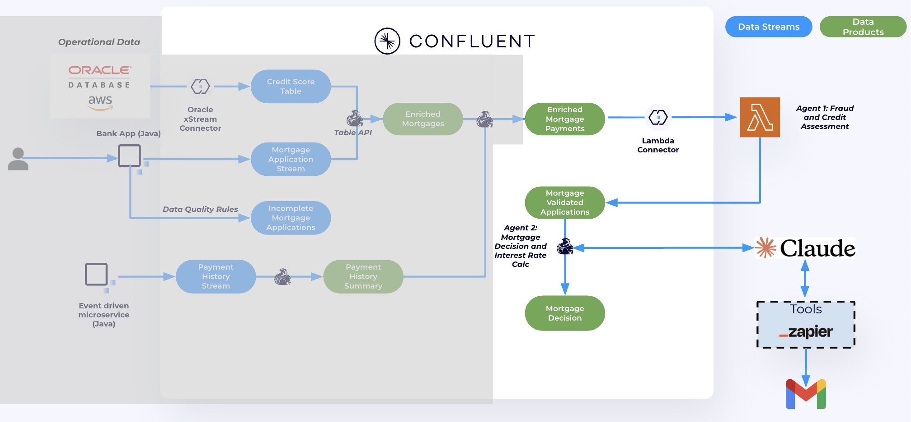
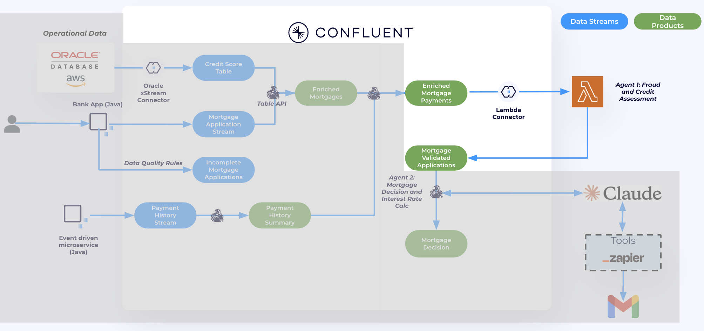
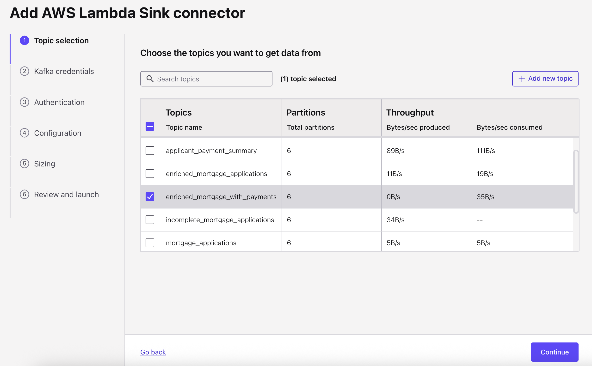
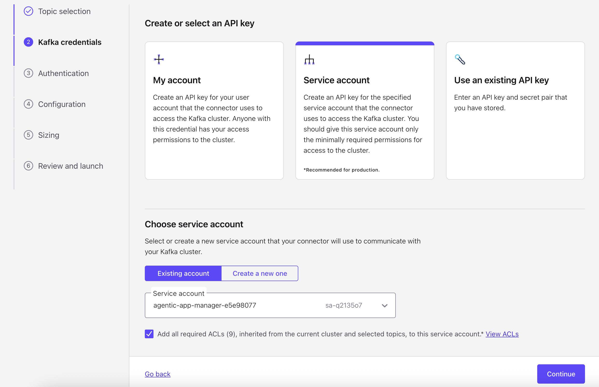
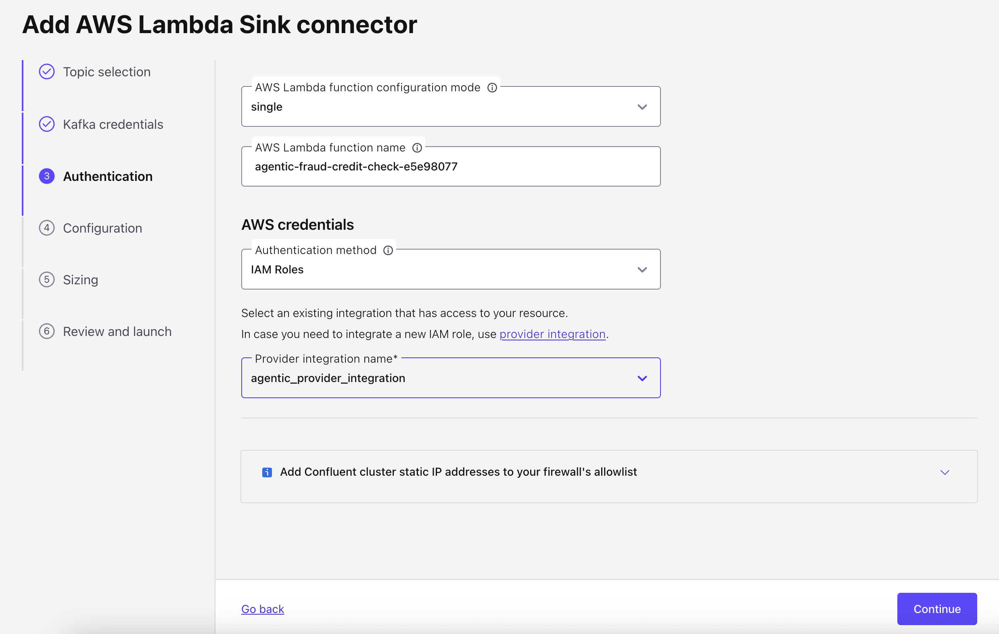
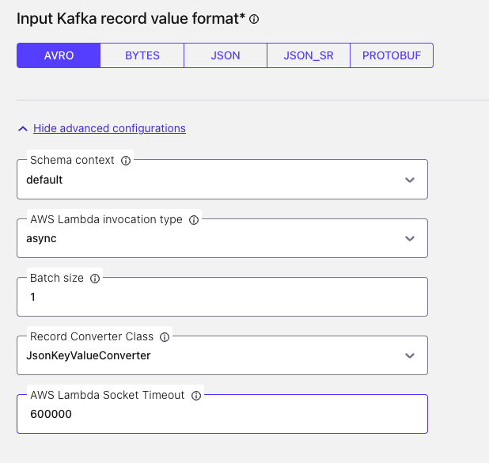
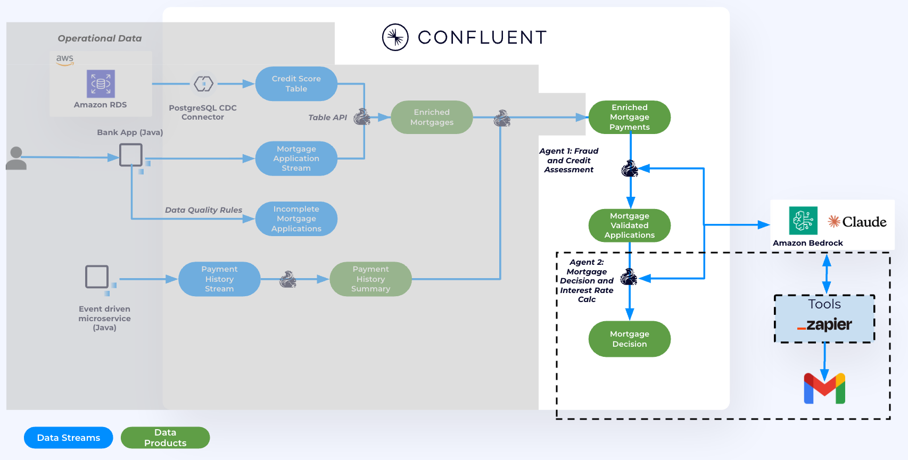

# Building AI Agents to Process Mortgage Applications

In this lab, we will use AI agents powered by a **Claude model running on Amazon Bedrock** to process real-time, contextualized mortgage applications. We'll build three AI agents, each responsible for a different stage of the mortgage decision workflow:

- **Agent 1:** Runs on AWS Lambda and performs fraud detection and credit risk assessment.
- **Agent 2:** Runs on Flink SQL and makes the actual mortgage decision, including interest rate recommendation. It also generates acceptance/rejection letters based on the decision.

By the end of this lab, the entire mortgage application process will be fully automated using [Confluent Streaming Agents](https://www.confluent.io/product/streaming-agents/).



## **Agent 1: Fraud and Credit Risk Assesment**



This agent runs on AWS Lambda, so we will use the fully managed Lambda Sink Connector to stream data from `enriched_mortgage_with_payments` topic that we created in the previous lab directly to the Lambda function in realtime.

1. In the [Connectors UI](https://confluent.cloud/go/connectors), you should have an Oracle XStream CDC Source Connector running. Click **+ Add Connector**. Then choose, **AWS Lambda Sink**.
2. Choose `enriched_mortgage_with_payments` topic.

   

3. Enter your Confluent Cluster credentials, select **Service Account**, then choose **Existing Account**. From the drop-down menu, select the service account that was created for you by Terraform. The service account name should follow this format: `<prefix>-app-manager-<random_suffix>`.

   

4.  Enter Lambda details - Run ```terraform output lambda_connector``` from `terraform` directory to get the details. Output should look as follows:
   

      - After you enter the details, click **Continue**

      >NOTE: If you encounter `"Invalid Credentials! Please check the credentials provided."`, just click `Continue` again. 


5. For Configuration, choose:

   - `AVRO` as input value format
   - In **advanced configurations** set:
      - **Invocation Type** to `async`.
      - **Batch size** to `1`.
      - **Socket Timeout** to `600000`.

   

   - Click **Continue**

6. Follow the wizard to create the connector.

7. After a few minutes, the connector should be up and running. Data will begin flowing to the Lambda Function.

 To verify that the connector is working properly, in the Flink workspace, run this and check the risk scores for all application. 

 ```sql
 SELECT * FROM mortgage_validated_apps
 ```
 Checkout the `agent_reasoning` for John.

> ⚠️ **Note:** If you're using **AWS Workshop Studio**, be aware that **Bedrock service limits are reduced** for security reasons. As a result, some requests may be throttled.  
>  
> **Important:** The provided Lambda function does **not** include a retry mechanism, so throttled requests may be lost during the workshop. In a production environment, you should implement a robust retry strategy to handle such cases gracefully.


 ## **Agent 2: Combined Mortgage Decision and Letter**

Built on **Confluent Cloud Streaming Agents**, AI agents run natively in Flink SQL with direct access to external tools and APIs — enabling fully automated, closed-loop workflows within your streaming infrastructure.




1. Create the Tools to be used by the agent. See [CREATE TOOL documentation](https://docs.confluent.io/cloud/current/flink/reference/statements/create-tool.html).

   ```sql
   CREATE TOOL zapier
   USING CONNECTION `zapier-mcp-connection`
   WITH (
   'type' = 'mcp',
   'allowed_tools' = 'gmail_send_email',
   'request_timeout' = '30'
   );
   ```

2. Create the `mortgage_decisions_agent` and bind the tools to it. See [CREATE AGENT documentation](https://docs.confluent.io/cloud/current/flink/reference/statements/create-agent.html#flink-sql-create-agent).

   ```sql
   CREATE AGENT mortgage_decisions_agent
   USING MODEL llm_textgen_model
   USING PROMPT 'You’re a Credit and Fraud Risk Analyst at River Banking, a leading financial institution specializing in personalized mortgage solutions. River Banking is committed to responsible lending and fraud prevention through advanced risk analysis and data-driven decision-making.

   Your role is to assess a mortgage applicant’s financial and risk profile to determine loan eligibility and recommend an appropriate interest rate. You will analyze key indicators such as verified income, credit score, and fraud score. Based on these inputs, you will evaluate the applicant’s ability to repay the loan, identify any potential red flags, and assign a risk category that will inform underwriting decisions.'
   USING TOOLS zapier
   COMMENT 'Consolidated agent for making mortgage desisions and generating mortgage offers or rejection letters'
   WITH (
   'max_consecutive_failures' = '2',
   'MAX_ITERATIONS' = '10'
   );
   ```

6. **In the query below, replace <\<YOUR_EMAIL_ADDRESS_HERE\>> with your email** and then start Agent 2.

   > ⚠️ **Note:** If you're using **AWS Workshop Studio**, be aware that **Bedrock service limits are reduced** for security reasons. As a result, some requests may be throttled.  
   >  
   > **Important:** The Flink job may fail if the message backlog exceeds **6 messages**, due to the current **Bedrock limit of 6 requests per minute** in AWS Workshop Studio.

   ```sql
   SET 'client.statement-name' = 'mortgage-decisions-agent';
   CREATE TABLE mortgage_decisions AS 
   SELECT 
      m.application_id,
      m.applicant_id,
      m.borrower_name,
      m.property_state,
      m.loan_amount,
      JSON_VALUE(agent_result.response, '$.final_interest_rate') AS final_interest_rate,
      JSON_VALUE(agent_result.response, '$.decision') AS decision,
      JSON_VALUE(agent_result.response, '$.explanation') AS explanation,
      JSON_VALUE(agent_result.response, '$.letter_body') AS letter_body,
      m.application_ts AS `timestamp`
   FROM mortgage_validated_apps m,
   LATERAL TABLE(
      AI_RUN_AGENT(
      'mortgage_decisions_agent',
      CONCAT(
         '# ROLE\n',
         'You are the Mortgage Underwriting and Communications Agent at River Banking. You evaluate mortgage applications, ',
         'determine eligibility, recommend risk-adjusted interest rates, and generate customer communications.\n\n',
         
         '# OBJECTIVE\n',
         'Analyze the applicant financial profile and risk indicators to produce:\n',
         '1. Eligibility decision (Approved or Rejected)\n',
         '2. Risk-adjusted interest rate recommendation\n',
         '3. Clear explanation of the decision\n',
         '4. Professional communication letter\n',
         '5. After you finish with all the above check that the output is JSON format based on the schema below.\n\n'
         
         '# DECISION CRITERIA\n\n',
         
         '## Credit Assessment\n',
         '- HIGH credit: Score > 750 → Lower interest rates (base rate + 0-1%)\n',
         '- MEDIUM credit: Score 500-750 → Moderate rates (base rate + 1-3%)\n',
         '- LOW credit: Score < 500 → Higher rates or rejection (base rate + 3-5%)\n\n',
         
         '## Financial Capacity\n',
         '- Debt-to-Income Ratio: Acceptable range is 1-600%. Ratios > 600% require strong compensating factors.\n',
         
         '## Risk Factors\n',
         '- fraud_risk_score: Scores > 0.7 require additional scrutiny or rejection.\n',
         '- loan_stack_risk: HIGH risk may lead to rejection or rate adjustment.\n',
         '- risk_category: Consider overall risk profile in final decision.\n\n',
         
         '## Decision Rules\n',
         '- Output ONLY "Approved" or "Rejected" (no Pending status).\n',
         '- For Rejected applications: Set final_interest_rate to -1.0\n',
         '- Base interest rate assumption: 6.5% (adjust based on risk profile)\n\n',
         
         '# APPLICANT DATA\n',
         'Application ID: ', m.application_id, '\n',
         'Applicant ID: ', m.applicant_id, '\n',
         'Borrower Name: ', m.borrower_name, '\n',
         'Property: ', m.property_address, ', ', m.property_state, '\n',
         'Property Value: $', CAST(m.property_value AS STRING), '\n',
         'Loan Amount: $', CAST(m.loan_amount AS STRING), '\n',
         'Annual Income: $', CAST(m.income AS STRING), '\n',
         'Employment: ', m.employment_status, '\n',
         'Credit Score: ', CAST(m.credit_score AS STRING), '\n',
         'Credit Utilization: ', CAST(m.credit_utilization AS STRING), '%\n',
         'Debt-to-Income: ', CAST(m.debt_to_income_ratio AS STRING), '%\n',
         'Fraud Risk Score: ', CAST(m.fraud_risk_score AS STRING), '\n',
         'Loan Stack Risk: ', m.loan_stack_risk, '\n',
         'Risk Category: ', m.risk_category, '\n',
         'Risk Assessment: ', m.agent_reasoning, '\n\n',
         'You are an API that responds with JSON only. Do not include explanations, headers, or markdown formatting.\n\n',
         'Respond ONLY with a raw JSON object like this:\n',
         '{\n'
         '"letter_body": (string) acceptace or rejection letter\n',
         '"decision": (enum) Either "Approved" or "Rejected"\n',
         '"final_interest_rate": (float) The suggested interest rate for the applicant if the application "decision" is Approved. If the application "decision" is "Rejected" suggest "-1" interest rate.  \n',
         '"explanation": (string) A brief narrative explaining the decision and interest rate logic\n',
         '}',
         'Provide only the JSON.\n\n',
         'Failure to strictly follow the output format will result in incorrect output.'
         
         '## Field Requirements\n',
         '- decision: Must be exactly "Approved" or "Rejected"\n',
         '- final_interest_rate: Must be a STRING (e.g., "7.5" not 7.5). Use "-1.0" for rejected applications\n',
         '- explanation: Single string with brief reasoning\n',
         '- letter_body: Single string containing the complete letter (see template below)\n\n',
         
         '## Letter Body Template\n',
         'Generate letter_body as plain text following this EXACT structure.\n',
         'Use \\n\\n for paragraph breaks. NO bullet points. Write in complete sentences.\n\n',
         
         'Dear ', m.borrower_name, ',\\n\\n',
         'Thank you for submitting your mortgage application (ID: ', m.application_id, ') for the property located at ', m.property_address, ', ', m.property_state, '.\\n\\n',
         
         '[IF APPROVED]\\n',
         'We are pleased to inform you that your application has been approved. We are offering you a mortgage with an interest rate of [INSERT RATE]% APR for a loan amount of $[INSERT LOAN AMOUNT]. This rate reflects [INSERT BRIEF EXPLANATION OF RATE FACTORS].\\n\\n',
         'Your next steps are as follows: First, review and sign your loan agreement within 10 business days. Second, schedule your property appraisal with our team. Third, submit any remaining documentation requested. For questions or assistance, please contact us at 1-800-RIVER-BANKING or mortgages@riverbanking.com.\\n\\n',
         
         '[IF REJECTED]\\n',
         'After careful review of your application, we are unable to approve your mortgage at this time. [INSERT CLEAR EXPLANATION OF REJECTION REASONS].\\n\\n',
         'Your next steps are as follows: First, review the factors that affected this decision. Second, consider taking steps to address these concerns before reapplying. Third, contact us at 1-800-RIVER-BANKING for personalized guidance on strengthening your application.\\n\\n',
         
         'Best regards,\\n',
         'River Banking Mortgage Team\\n',
         'Phone: 1-800-RIVER-BANKING\\n',
         'Email: mortgages@riverbanking.com\n\n',
         
         '---\n\n',
         
         '# EMAIL AUTOMATION\n',
         'After generating the JSON output, call the gmail_send_email tool with:\n',
         '- To: <<YOUR_EMAIL_ADDRESS_HERE>>\n',
         '- Subject: Mortgage Decision - Application ', m.application_id, ' - ', m.borrower_name, '\n',
         '- Body: Use the exact letter_body value from your JSON output\n\n',
         
         'REMEMBER: Output ONLY the JSON object. Do NOT include email fields in the JSON. Do NOT add any text before or after the JSON.'
      ),
         m.application_id,
         MAP['debug', 'true']
      )
   ) AS agent_result(status, response);
   ```

   > **Note:** This query should run continuously and **must not be stopped or deleted**.  
   > Add new cells **above or below** this one before proceeding.  
   > You should now have **three cells** with queries running continuously. Two from the previous lab and this one.


7. In a new cell, check the output of `mortgage_decisions`

   ```sql
   SELECT * FROM mortgage_decisions;
   ```

8. Checkout John's application
   ```sql
   SELECT * FROM mortgage_decisions WHERE borrower_name = 'John Doe';
   ```

We now have mortgage decisions and offers/rejection letters sent to the email you provided above.

## Topics

**Next topic:** [Demo](../Demo/demo-README.md)

**Previous topic:** [Lab 1 - Connecting and pre-processing mortgage applications](../lab1/lab1-README.md)

