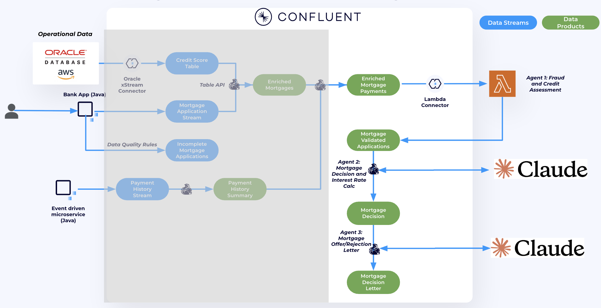
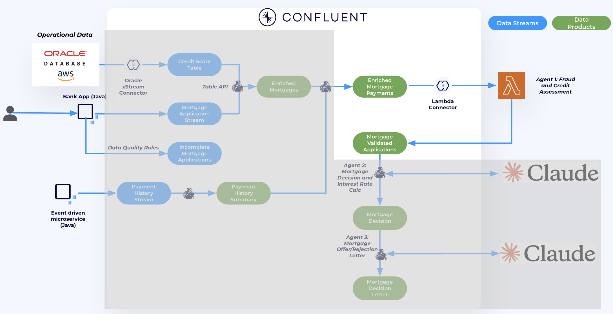
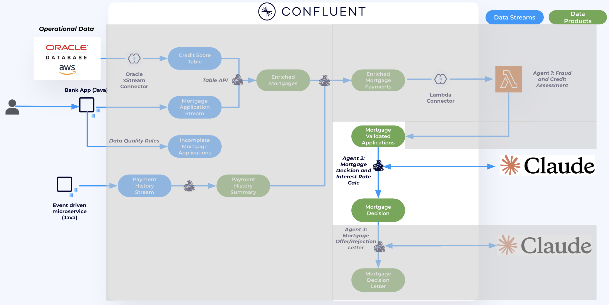

# Building AI Agents to Process Mortgage Applications

In this lab, we will use AI agents powered by a **Claude model running on Amazon Bedrock** to process real-time, contextualized mortgage applications. We'll build three AI agents, each responsible for a different stage of the mortgage decision workflow:

- **Agent 1:** Runs on AWS Lambda and performs fraud detection and credit risk assessment.
- **Agent 2:** Runs on Flink SQL and makes the actual mortgage decision, including interest rate recommendation.
- **Agent 3:** Also runs on Flink SQL and, based on Agent 2’s decision, generates either a mortgage offer or a rejection letter.

By the end of this lab, the entire mortgage application process will be fully automated using intelligent, Bedrock-powered agents.



## Prerequisites

Before starting this lab, make sure you have completed [**Lab 1 – Connecting and Pre-processing Mortgage Applications**](../lab1/lab1-README.md).

## 🔓 Enabling Claude Sonnet 3.7 on Your AWS Account

To enable **Claude 3.7 Sonnet** in your AWS account via Amazon Bedrock:

1. Open the [Amazon Bedrock Console](https://console.aws.amazon.com/bedrock/home?/overview), make sure you are in the same region.
2. In the left sidebar, under **Bedrock configuration**, click **Model access**.
3. Locate **Claude 3.7 Sonnet** in the list of available models.
4. Click **Available to request**, then select **Request model access**.
5. In the request wizard, click **Next** and follow the prompts to complete the request.


⏱️ *Provisioning may take 5–10 minutes.*

Once enabled, you’ll need to retrieve the **model ID** for use in your applications.

3. In the Bedrock UI, navigate to **Anthropic**, then select the **Claude Sonnet 3.7** model.

   - In the **Details** section, locate the **Model ID**.
   - Copy this value — you’ll need it later. The Model ID should look something like:
      ```
      anthropic.claude-3-7-sonnet-20250219-v1:0
      ```
4. We’ll use this model ID to construct the endpoint for invoking the model.

   > **Note:** Prefix the `<model_id>` with `us.` for US-based regions or `eu.` for EU-based regions.  
   > Omitting the region prefix will prevent successful model invocation.
   
   Example (us-east-1):
      ```
      https://bedrock-runtime.us-east-1.amazonaws.com/model/us.anthropic.claude-3-7-sonnet-20250219-v1:0/invoke
      ```

We will use this endpoint later in the lab.

## **Agent 1: Fraud and Credit Risk Assesment**



This agent runs on AWS Lambda, so we will use the fully managed Lambda Sink Connector to stream data from `enriched_mortgage_with_payments` topic that we created in the previous lab directly to the Lambda function in realtime.

1. In the [Connectors UI](https://confluent.cloud/go/connectors), you should have an Oracle XStream CDC Source Connector running. Click **+ Add Connector**. Then choose, **AWS Lambda Sink**.
2. Choose `enriched_mortgage_with_payments` topic.

   

3. Enter your Confluent Cluster credentials, select **Service Account**, then choose **Existing Account**. From the drop-down menu, select the service account that was created for you by Terraform. The service account name should follow this format: `<prefix>-app-manager-<random_suffix>`.

   

4.  Enter Oracle details - Run ```terraform output lambda_connector``` from `terraform` directory to get the details. Output should look as follows:
   

      - After you enter the details, click **Continue**


5. For Configuration, choose:

   - `AVRO` as input value format
   - In **advanced configurations** set:
      - **Invocation Type** to `async`.
      - **Batch size** to `1`.
      - **Socket Timeout** to `600000`.

   

   - Click **Continue**

6. Follow the wizard to create the connector.

7. After a few minutes, the connector should be up and running. Data will begin flowing to the Lambda Function.

 To verify that the connector is working properly, in the Flink workspace, run this and check the risk scores for all application. 

 ```sql
 SELECT * FROM mortgage_validated_apps
 ```
 Checkout the `agent_reasoning` for John.

> ⚠️ **Note:** If you're using **AWS Workshop Studio**, be aware that **Bedrock service limits are reduced** for security reasons. As a result, some requests may be throttled.  
>  
> **Important:** The provided Lambda function does **not** include a retry mechanism, so throttled requests may be lost during the workshop. In a production environment, you should implement a robust retry strategy to handle such cases gracefully.


 ## **Agent 2: Mortgage Desicion**

This agent runs on **Confluent Cloud for Apache Flink**, where ML models are treated as first-class citizens. You can register a model once and use it seamlessly within Flink SQL queries.

First, we will register the model in the **Confluent Catalog**, then consume the output of Agent 1 as input for Agent 2.  
We will use the built-in [`ml_predict()`](https://docs.confluent.io/cloud/current/flink/reference/functions/model-inference-functions.html#ml-predict) function to invoke the model hosted on **Amazon Bedrock**.



1. In your terminal, install `confluent-cli` by following these [instructions](https://docs.confluent.io/confluent-cli/current/install.html).
2. Configure `confluent-cli`:
   ```
   confluent login --save
   ```
   - Enter email and password

3. Configure AWS Environment variables if you are using a new terminal.

   If you're using **AWS Workshop Studio**, click on **Get AWS CLI Credentials** to retrieve the necessary access key, secret key, and region. Then, run the following command to configure the CLI:
   <details>
   <summary>Click to expand for MAC</summary>

   ```
   export AWS_DEFAULT_REGION="<cloud_region>"
   export AWS_ACCESS_KEY_ID="<AWS_API_KEY>"
   export AWS_SECRET_ACCESS_KEY="<AWS_SECRET>"
   export AWS_SESSION_TOKEN="<AWS_SESSION_TOKEN>"
   ```

   </details>

   <details>
   <summary>Click to expand for Windows CMD</summary>

   ```
   set AWS_DEFAULT_REGION="<cloud_region>"
   set AWS_ACCESS_KEY_ID="<AWS_API_KEY>"
   set AWS_SECRET_ACCESS_KEY="<AWS_SECRET>"
   set AWS_SESSION_TOKEN="<AWS_SESSION_TOKEN>"
   ```
   </details>

4. Run the following command to create a connection resource named `bedrock-claude-connection` that uses your AWS credentials.

   ```
   confluent flink connection create bedrock-claude-connection \
   --cloud AWS \
   --region <CLOUD_REGION> \
   --environment <CONFLUENT_ENV_ID> \
   --type bedrock \
   --endpoint https://bedrock-runtime.<CLOUD_REGION>.amazonaws.com/model/us.anthropic.claude-3-7-sonnet-20250219-v1:0/invoke \
   --aws-access-key $AWS_ACCESS_KEY_ID \
   --aws-secret-key $AWS_SECRET_ACCESS_KEY \
   --aws-session-token $AWS_SESSION_TOKEN
   ```

5. In Flink workspace, create the model
   ```sql
   CREATE MODEL loan_eligibility_model
   INPUT(message STRING)
   OUTPUT(application_id STRING, decision STRING, final_interest_rate FLOAT, explanation STRING)
   COMMENT 'Analyze risk assessment and determine loan eligibility'
   WITH (
   'provider' = 'bedrock',
   'task' = 'text_generation',
   'bedrock.output_format'='json:/content/0/text',
   'bedrock.connection'='bedrock-claude-connection',
   'bedrock.PARAMS.max_tokens' = '20000',
   'bedrock.system_prompt' = 'You’re a Credit and Fraud Risk Analyst at River Banking, a leading financial institution specializing in personalized mortgage solutions. River Banking is committed to responsible lending and fraud prevention through advanced risk analysis and data-driven decision-making.
   Your role is to assess a mortgage applicant’s financial and risk profile to determine loan eligibility and recommend an appropriate interest rate. You will analyze key indicators such as verified income, credit score, and fraud score. Based on these inputs, you will evaluate the applicant’s ability to repay the loan, identify any potential red flags, and assign a risk category that will inform underwriting decisions.
   All responses should be formatted as JSON and JSON only according to the output format guidance.'
   );
   ```

6. Start Agent 2

> ⚠️ **Note:** If you're using **AWS Workshop Studio**, be aware that **Bedrock service limits are reduced** for security reasons. As a result, some requests may be throttled.  
>  
> **Important:** The Flink job may fail if the message backlog exceeds **6 messages**, due to the current **Bedrock limit of 6 requests per minute** in AWS Workshop Studio.


   ```sql
   SET 'client.statement-name' = 'mortgage_decisions-materializer';
   CREATE TABLE mortgage_decisions AS
   SELECT 
   m.application_id,
   applicant_id,
   borrower_name,
   property_state,
   loan_amount,
   decision,
   final_interest_rate,
   explanation,
   application_ts AS `timestamp`
   FROM mortgage_validated_apps m
   CROSS JOIN LATERAL TABLE(
   ml_predict(
      'loan_eligibility_model',
      CONCAT(
         'Using the applicant’s full financial profile and computed risk indicators, generate a Loan Eligibility ','and Interest Rate Recommendation that determines whether the applicant qualifies for a mortgage and, ',
         'if so, at what interest rate. This decision supports River Banking’s commitment to responsible, ',
         'personalized mortgage lending.\n\n',
         'Key Responsibilities:\n',
         '- Assess income, loan amount, debt-to-income ratio, and employment status to evaluate repayment capacity.\n',
         '- Analyze the applicant’s credit score and credit utilization to determine creditworthiness.\n',
         '- Lower credit scores should yield a higher interest rate while high credit scores yield a lower interest rate.\n',
         '- Incorporate risk signals such as fraud_risk_score, loan_stack_risk, and risk_category to flag high-risk profiles.\n',
         '- Use agent_reasoning to interpret key patterns in the applicant’s financial and risk background.\n',
         '- Return a clear decision on mortgage eligibility and recommend a fair, risk-adjusted interest rate.\n',
         '- Provide a concise explanation of the final decision to support downstream underwriting automation.\n\n',
         'Applicant’s Financial and Risk Profile:\n',
         'Application ID:', m.application_id, '\n',
         'Applicant ID:', applicant_id, '\n',
         'Email:', customer_email, '\n',
         'Borrower Name:', borrower_name, '\n',
         'Income:', CAST(income AS STRING), '\n',
         'Loan Amount:', CAST(loan_amount AS STRING), '\n',
         'Property Address:', property_address, '\n',
         'Property State:', property_state, '\n',
         'Property Value:', CAST(property_value AS STRING), '\n',
         'Employment Status:', employment_status, '\n',
         'Credit Score:', CAST(credit_score AS STRING), '\n',
         'Credit Utilization:', CAST(credit_utilization AS STRING), '\n',
         'Debt to Income Ratio:', CAST(debt_to_income_ratio AS STRING), '\n',
         'Fraud Risk Score:', CAST(fraud_risk_score AS STRING), '\n',
         'Loan Stack Risk:', loan_stack_risk, '\n',
         'Risk Category:', risk_category, '\n',
         'Agent Reasoning:', agent_reasoning, '\n\n',
         'You are an API that responds with JSON only. Do not include explanations, headers, or markdown formatting.\n\n',
         'Respond ONLY with a raw JSON object like this:\n',
         '{\n'
         '"application_id": (string) Unique ID for the application\n',
         '"decision": (enum) Either "Approved", "Rejected", or "Pending"\n',
         '"final_interest_rate": (float) The suggested interest rate for the applicant if the application "decision" is Approved. If the application "decision" is "Pending" or "Rejected" suggest 0.0 interest rate.  \n',
         '"explanation": (string) A brief narrative explaining the decision and interest rate logic\n',
         '}',
         'Provide only the JSON.\n\n',
         'Failure to strictly follow the output format will result in incorrect output.'
      )
   )
   ) AS loan_eligibility;
   ```

   > **Note:** This query should run continuously and **must not be stopped or deleted**.  
   > Add new cells **above or below** this one before proceeding.  
   > You should now have **three cells** with queries running continuously. Two from the previous lab and this one.


7. In a new cell, check the output of `mortgage_decisions`

   ```sql
   SELECT * FROM mortgage_decisions;
   ```

8. Checkout John's application
   ```sql
   SELECT * FROM mortgage_decisions WHERE borrower_name = 'John Doe';
   ```

We now have mortgage decisions and are ready to generate offers and rejection letters.

 ## **Agent 3: Mortgage Offer/Rejection Letter**

 Now that we have Mortgage decisions, Agent 3 will either generate an offer or a rejection letter based on this decisisn. 

 Again this model runs on Confluent Cloud for Apache Flink. We will first create the model and then take the output of agent 2 as the input for agent 3. This time we do not need to create a connection as it is already created. 


1. In Flink workspace, create the model

   ```sql
   CREATE MODEL mortgage_decision_model
   INPUT(message STRING)
   OUTPUT(response STRING)
   COMMENT 'Based on the mortgage decision, generates an approval or rejection letter for the client.'
   WITH (
   'provider' = 'bedrock',
   'task' = 'text_generation',
   'bedrock.PARAMS.max_tokens' = '20000',
   'bedrock.connection'='bedrock-claude-connection',
   'bedrock.system_prompt' = 'You are a Mortgage Offer Agent at River Banking, a leading financial institution specializing in responsible, personalized mortgage lending. River Banking is committed to transparent underwriting decisions that clearly communicate the reasoning behind every mortgage approval or rejection.
   
   Your role is to read finalized mortgage decisions that include the applicant’s ID, loan eligibility outcome,interest rate (if approved), and an underwriting explanation. Based on this data, generate a formal mortgage
   offer letter or rejection notice. The letter should reflect River Banking’s tone—professional, clear, and
   empathetic—and summarize the key reasons behind the decision.
   
   If the loan is approved, provide a congratulatory offer message that includes the approved interest rate and a
   brief recap of why the applicant qualified.
   
   If the loan is rejected, write a polite and supportive rejection message that explains the key factors contributing to the decision without disclosing sensitive internal scoring logic.'
   );
   ```

2. Build Agent 3

> ⚠️ **Note:** If you're using **AWS Workshop Studio**, be aware that **Bedrock service limits are reduced** for security reasons. As a result, some requests may be throttled.  
>  
> **Important:** The Flink job may fail if the message backlog exceeds **6 messages**, due to the current **Bedrock limit of 6 requests per minute** in AWS Workshop Studio.

   ```sql
   SET 'client.statement-name' = 'mortgage-final-decisions-materializer';
   CREATE TABLE mortgage_final_decisions AS
   SELECT
   CAST(d.application_id AS BYTES) AS `key`,
   d.application_id,
   d.applicant_id,
   a.customer_email,
   a.customer_name as borrower_name,
   mortgage_letter.response AS letter
   FROM mortgage_decisions d
   JOIN mortgage_applications a
   ON d.application_id = a.application_id
   CROSS JOIN LATERAL TABLE(
   ml_predict(
      'mortgage_decision_model',
      CONCAT(
         'You are a Mortgage Offer Agent at River Banking. Your job is to generate a ',
         'formal mortgage approval or rejection letter based on final underwriting decisions.\n',
         'Each decision includes an application ID, applicant ID, decision status, loan amount, ',
         'interest rate (if applicable), and an explanation of the reasoning behind the decision.\n\n',
         'Instructions:\n',
         '- If the decision is "Approved", write a friendly and professional offer letter confirming the approval, loan amount, and final interest rate. Include a summary of why the applicant was approved.\n',
         '- If the decision is "Rejected", write a polite rejection letter explaining the primary reasons, using the explanation field. Be supportive and avoid technical jargon.\n',
         '- The tone should be respectful, clear, and aligned with River Banking’s values of transparency and personalized service.\n\n',
         'Input Data:\n',
         'Application ID: ', d.application_id, '\n',
         'Applicant ID: ', d.applicant_id, '\n',
         'Customer Name: ', a.customer_name, '\n',
         'Loan Amount: ', CAST(a.loan_amount AS STRING), '\n',
         'Decision: ', d.decision, '\n',
         'Final Interest Rate: ', CAST(COALESCE(d.final_interest_rate, 0.0) AS STRING), '\n',
         'Explanation: ', d.explanation, '\n\n',
         'Expected Output – Mortgage Decision Letter',
         'Subject: <Subject Line for Email>',
         'Body: \n\n<Body of Email>'
      )
   )
   ) AS mortgage_letter;
   ```

   > **Note:** This query should run continuously and **must not be stopped or deleted**.  
   > Add new cells **above or below** this one before proceeding.  
   > You should now have **four cells** with queries running continuously. Two from the previous lab and two in this lab.


7. In a new cell, check the output of `mortgage_final_decisions`

   ```sql
   SELECT * FROM mortgage_final_decisions;
   ```

8. Checkout John's letter

   ```sql
   SELECT * FROM mortgage_final_decisions WHERE borrower_name = 'John Doe';
   ```

## Topics

**Next topic:** [Demo](../Demo/demo-README.md)

**Previous topic:** [Lab 1 - Connecting and pre-processing mortgage applications](../lab1/lab1-README.md)

